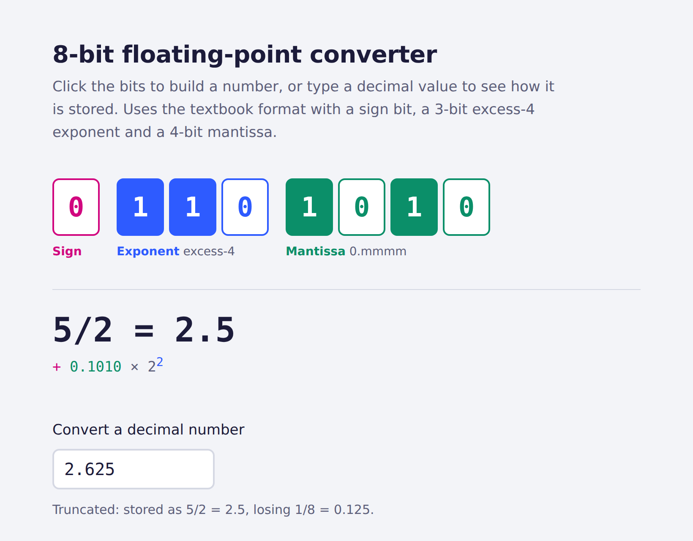
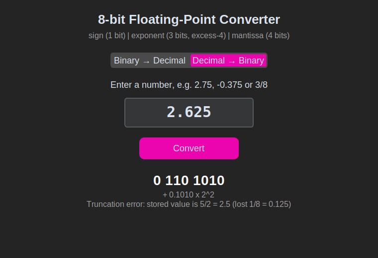

# 8-bit Floating-Point Converter

Converts numbers between decimal and an **8-bit floating-point format** in both directions, showing how each value is stored and how much precision is lost to truncation. Available as a **web app** and a **desktop app** (CustomTkinter), both backed by the same tested algorithm.

**[▶ Try it in your browser](https://bniko05.github.io/8bit-floating-point-converter/)**



---

## The format

```
  s   e e e   m m m m
  │   └─┬─┘   └──┬──┘
  │     │        └── mantissa: 4 bits, read as 0.mmmm
  │     └─────────── exponent: 3 bits, excess-4 notation (−4 … 3)
  └───────────────── sign: 0 = positive, 1 = negative

  value = (−1)^s × 0.mmmm₂ × 2^(eee − 4)
```

| Bits | Breakdown | Value |
|---|---|---|
| `0 110 1011` | + 0.1011₂ × 2² | 11/4 = **2.75** |
| `1 011 1100` | − 0.1100₂ × 2⁻¹ | −3/8 = **−0.375** |
| `0 111 1111` | + 0.1111₂ × 2³ | **7.5** (largest value) |
| `0 000 1000` | + 0.1000₂ × 2⁻⁴ | **0.03125** (smallest normalized) |

When converting a decimal number, the value is **normalized** so the first mantissa bit is 1, and any bits that do not fit are **truncated**. For example, 2.625 = 10.101₂ = 0.10101₂ × 2², but only four mantissa bits fit, so it is stored as `0 110 1010` = 2.5, a truncation error of 0.125.

This is the teaching format from J. Glenn Brookshear's *Computer Science: An Overview*. It follows the same sign / biased exponent / mantissa idea as IEEE 754, but without IEEE 754's hidden leading bit, subnormal numbers, infinities or NaN.

---

## Features

- **Both directions:** 8 bits → exact value, and decimal → 8 bits.
- **Exact arithmetic:** uses `fractions.Fraction` (and BigInt in the web version), so results never suffer from floating-point rounding.
- **Explains the result:** shows the sign / exponent / mantissa breakdown and the truncation error when a value cannot be stored exactly.
- **Handles edge cases:** reports overflow (|x| ≥ 8) and underflow (|x| < 1/32) instead of producing wrong bits.
- **Flexible input:** accepts decimals, negative numbers, fractions (`3/8`) and scientific notation (`1e-2`).
- **Input validation:** the binary field only accepts 0 and 1, and both modes explain what is wrong with invalid input.

---

## Run the desktop app

```bash
git clone https://github.com/bniko05/8bit-floating-point-converter.git
cd 8bit-floating-point-converter
pip install -r requirements.txt
python app.py
```



---

## Project structure

```
├── converter.py          # conversion logic (no GUI code, fully tested)
├── app.py                # desktop GUI (CustomTkinter)
├── docs/                 # web version, served by GitHub Pages
│   ├── index.html
│   └── converter.js      # JavaScript port of converter.py
├── tests/
│   ├── test_converter.py            # unit tests, incl. all 256 bit patterns
│   └── test_web_matches_python.py   # checks the web and Python versions agree
└── .github/workflows/tests.yml      # runs the tests on every push
```

The conversion logic lives in `converter.py`, separate from the interface, so it can be tested without a GUI and reused by both apps.

---

## Testing

```bash
pip install pytest
pytest
```

The suite includes:
- known values from the textbook, plus overflow, underflow and invalid input;
- a **round-trip test over all 256 bit patterns** (decode, then encode, then decode again);
- a **cross-check between the Python and JavaScript implementations** on 700+ random inputs, so the web version cannot drift from the tested algorithm.

Tests run automatically with GitHub Actions on every push.

---

## Version 2 changes

The first version (2024) worked for binary → decimal but had several bugs in decimal → binary conversion, found by writing tests for it:

| Input | Old output | Correct output | Cause |
|---|---|---|---|
| `1`, `2`, `4` | `0 100 0000`, `0 101 0000`, `0 110 0000` (all equal to 0) | `0 101 1000`, `0 110 1000`, `0 111 1000` | normalization loop stopped too early for powers of two |
| `10` | `0 101 0000` (= 0) | overflow error | no range check |
| `0.1875` | `0 100 0011` (unnormalized, loses precision) | `0 010 1100` | negative exponents were never used |
| `0.03125` | error | `0 000 1000` | scientific notation in `str(float)` broke parsing |
| `0110` (4 bits) | 0 | error | input length was not checked |

The rewrite also separated the logic from the GUI, replaced floating-point digit manipulation with exact fractions, and added the web version and test suite.

---

## Author

**Vasileios Nikolaou** ([@bniko05](https://github.com/bniko05)), Department of Informatics, Athens University of Economics and Business
